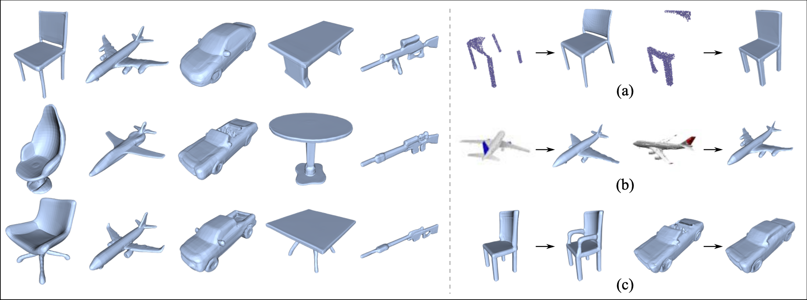

# SDF-StyleGAN: Implicit SDF-Based StyleGAN for 3D Shape Generation (SGP 2022)

This repository contains the core implementation of our paper:

**[SDF-StyleGAN: Implicit SDF-Based StyleGAN for 3D Shape Generation](https://zhengxinyang.github.io/projects/SDF_stylegan.html)**
<br>
[Xin-Yang Zheng](https://zhengxinyang.github.io/),
[Yang Liu](https://xueyuhanlang.github.io/),
[Peng-Shuai Wang](https://wang-ps.github.io/),
[Xin Tong](https://www.microsoft.com/en-us/research/people/xtong/).
<br>
<br>



## Installation

Following is the suggested way to install the dependencies of our code:

```
conda create --name stylegan python=3.8
conda activate stylegan
conda install pytorch==1.8.0 torchvision==0.9.0 torchaudio==0.8.0 cudatoolkit=11.1 -c pytorch -c conda-forge
pip install fire scikit-image==0.18.2 scikit-learn==0.24.2 trimesh kornia==0.5.8 pyglet pyrender pyrr
pip install pytorch-lightning==1.5.1
```

## Data Preparation

### Data creation

Our SDF field training data was generated by following the pipepline described in the paper <a href="https://github.com/microsoft/DualOctreeGNN" target="_blank">DualOctreeGNN</a>. Please ref to <a href="https://github.com/microsoft/DualOctreeGNN#21-data-preparation" target="_blank">its script</a> for generating the SDF field from ShapeNet data or your customized data.

### Preprocessed Data

Our training data is also available (total 165G+).
Here is <a href="https://pan.baidu.com/s/1nVS7wlcOz62nYBgjp_M8Yg?pwd=oj1b">the link</a>.

## Usage

### Train from Scratch

Please modify the data path in the scripts, then run

```
bash scripts/train_{DATA_CLASS}.sh
```

### Shape Generation

We provide the pretrained models in <a href="https://drive.google.com/drive/folders/1pbtileaz2eMAiP2uK_u22c3JyhGq-WVC?usp=sharing" target="_blank">here</a>. You can download them and modify the model path in the scripts, then run

```
bash scripts/generate_{DATA_CLASS}.sh
```

### Shading image based FID computation

You can try the demo that generates images for FID calculation. Please refer to our paper for more technical details.

```
python generate_for_fid.py --model_path {YOU_MODEL_PATH}
```

<!-- ## Other evaluation Metrics
Please ref to
<a href="https://github.com/jtpils/TreeGAN" target="_blank">TreeGAN</a>, <a href="https://github.com/AnTao97/dgcnn.pytorch" target="_blank">DGCNN</a>, <a href="https://github.com/stevenygd/PointFlow" target="_blank">PointFlow</a>, <a href="https://github.com/Sunwinds/ShapeDescriptor" target="_blank">ShapeDescriptor</a> and <a href="https://github.com/GaParmar/clean-fid" target="_blank">Clean-FID</a> -->

## Acknowledgements

We use the following third-party codes.

- <a href="https://github.com/Hippogriff/rendering" target="_blank">https://github.com/Hippogriff/rendering</a>
- <a href="https://github.com/lucidrains/stylegan2-pytorch" target="_blank">https://github.com/lucidrains/stylegan2-pytorch</a>
- <a href=" https://github.com/NVlabs/stylegan2-ada-pytorch" target="_blank"> https://github.com/NVlabs/stylegan2-ada-pytorch</a>

## Citation

If you find our work useful in your research, please consider citing:

```
@inproceedings{zheng2022sdfstylegan,
  title = {SDF-StyleGAN: Implicit SDF-Based StyleGAN for 3D Shape Generation},
  author = {Zheng, Xin-Yang and Liu, Yang and Wang, Peng-Shuai and Tong, Xin},
  booktitle = {Comput. Graph. Forum (SGP)},
  year = {2022},
}
```
